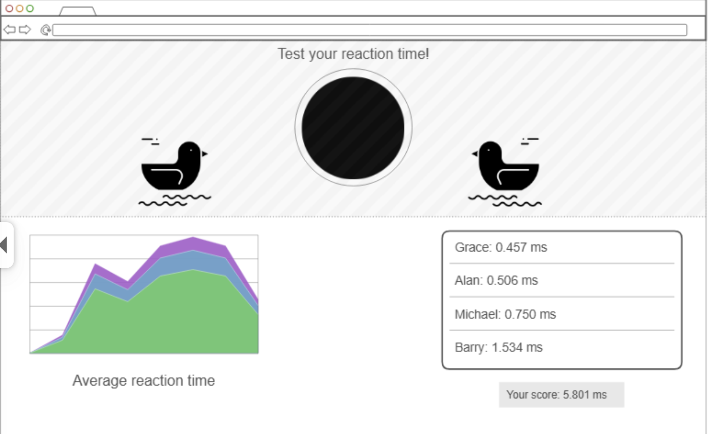
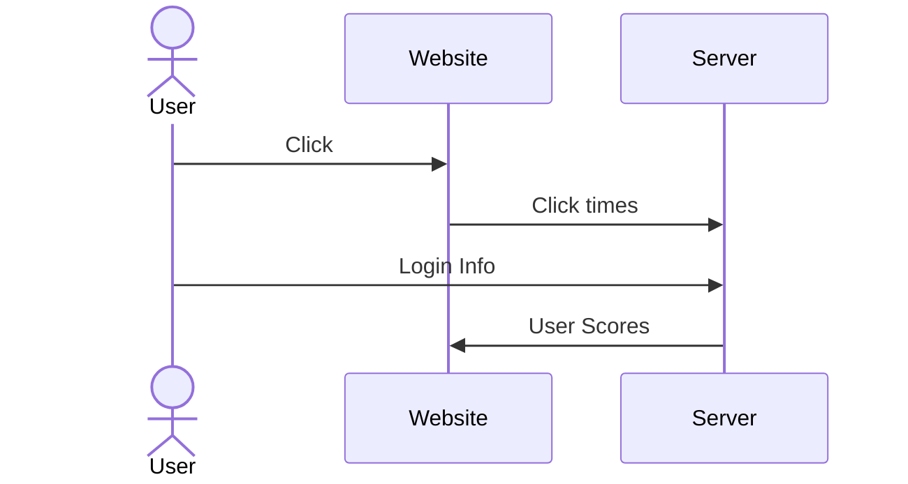

# Reactionary

[My Notes](notes.md)

Reactionary is a simple reaction-testing game that allows users to test their reaction times and compare them with the average reaction time and compare them with the reaction times of others. It will take three tests and then average out the results.

There are many factors to reaction time, and the hope is to help others recognize how those factors affect their reaction time by showing them different situations that impact them.

## 🚀 Specification Deliverable

For this deliverable I did the following. I checked the box `[x]` and added a description for things I completed.

- [x] Proper use of Markdown
- [x] A concise and compelling elevator pitch
- [x] Description of key features
- [x] Description of how you will use each technology
- [x] One or more rough sketches of your application. Images must be embedded in this file using Markdown image references.

### Elevator pitch

Test how fast you are! Find your reaction time and see how you compare to others. Prove to your friends that your reaction time is better than others. However, this isn't just your ordinary reaction test. This tests users in all kinds of situations, sometimes random locations or random pictures so that user can know how they fare under different circumstances.

### Design

Rough design as to how server functionality will work.

### Key features

- Secure login using HTTPS
- Button that must be clicked on
- Timer
- Randomized times between button presses
- Totals from all users in real time
- Scoreboard
- Results are permanently stored

### Technologies

I am going to use the required technologies in the following ways.

- **HTML** - Two HTML pages. One for login and the other for button test and scoring.
- **CSS** - Styling that uses color contrast for button and leaderboard. Different formatting for different screen sizes.
- **React** - Login functionality, Button functionality, and displaying scoreboard.
- **Service** - Backend with endpoints for 
    -  submitting scores 
    -  login 
    -  recieving scores
    -  retrieving user data
    -  Calls to (https://random-d.uk/api) for randomized reaction images.
- **DB/Login** - Stores login users and scores. Users who are not registered or logged in cannot have their scores posted.
- **WebSocket** - Scores are updated and shown to all users.

## 🚀 AWS deliverable

For this deliverable I did the following. I checked the box `[x]` and added a description for things I completed.

- [x] **Server deployed and accessible with custom domain name** - [My server link](https://reactionary.click/).

## 🚀 HTML deliverable

For this deliverable I did the following. I checked the box `[x]` and added a description for things I completed.

- [x] **HTML pages** - I have three pages, an about page `about.html`, the game page `game.html`, and the login page `index.html`.
- [x] **Proper HTML element usage** - I used several html elements and learned about a few like table and link. I also learned a bit about how svg works and how to organize html pages a bit better.
- [x] **Links** - Each page links to the other pages
- [x] **Text** - Every page has headers and the about me page has text describing the game.
- [x] **3rd party API placeholder** - Placeholder ducks for distraction. Will call random duck for 3rd party. Also 3rd party placeholder for chart creation.
- [x] **Images** - Two placeholder ducks.
- [x] **Login placeholder** - Placeholder login in `index.html`
- [x] **DB data placeholder** - Placeholder table for high scores.
- [x] **WebSocket placeholder** - Notification placeholder for player input.

## 🚀 CSS deliverable

For this deliverable I did the following. I checked the box `[x]` and added a description for things I completed.

- [ ] **Visually appealing colors and layout. No overflowing elements.** - I did not complete this part of the deliverable.
- [ ] **Use of a CSS framework** - I did not complete this part of the deliverable.
- [ ] **All visual elements styled using CSS** - I did not complete this part of the deliverable.
- [ ] **Responsive to window resizing using flexbox and/or grid display** - I did not complete this part of the deliverable.
- [ ] **Use of a imported font** - I did not complete this part of the deliverable.
- [ ] **Use of different types of selectors including element, class, ID, and pseudo selectors** - I did not complete this part of the deliverable.

## 🚀 React part 1: Routing deliverable

For this deliverable I did the following. I checked the box `[x]` and added a description for things I completed.

- [ ] **Bundled using Vite** - I did not complete this part of the deliverable.
- [ ] **Components** - I did not complete this part of the deliverable.
- [ ] **Router** - I did not complete this part of the deliverable.

## 🚀 React part 2: Reactivity deliverable

For this deliverable I did the following. I checked the box `[x]` and added a description for things I completed.

- [ ] **All functionality implemented or mocked out** - I did not complete this part of the deliverable.
- [ ] **Hooks** - I did not complete this part of the deliverable.

## 🚀 Service deliverable

For this deliverable I did the following. I checked the box `[x]` and added a description for things I completed.

- [ ] **Node.js/Express HTTP service** - I did not complete this part of the deliverable.
- [ ] **Static middleware for frontend** - I did not complete this part of the deliverable.
- [ ] **Calls to third party endpoints** - I did not complete this part of the deliverable.
- [ ] **Backend service endpoints** - I did not complete this part of the deliverable.
- [ ] **Frontend calls service endpoints** - I did not complete this part of the deliverable.
- [ ] **Supports registration, login, logout, and restricted endpoint** - I did not complete this part of the deliverable.

## 🚀 DB deliverable

For this deliverable I did the following. I checked the box `[x]` and added a description for things I completed.

- [ ] **Stores data in MongoDB** - I did not complete this part of the deliverable.
- [ ] **Stores credentials in MongoDB** - I did not complete this part of the deliverable.

## 🚀 WebSocket deliverable

For this deliverable I did the following. I checked the box `[x]` and added a description for things I completed.

- [ ] **Backend listens for WebSocket connection** - I did not complete this part of the deliverable.
- [ ] **Frontend makes WebSocket connection** - I did not complete this part of the deliverable.
- [ ] **Data sent over WebSocket connection** - I did not complete this part of the deliverable.
- [ ] **WebSocket data displayed** - I did not complete this part of the deliverable.
- [ ] **Application is fully functional** - I did not complete this part of the deliverable.
